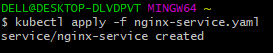

# DOCUMENTATION OF PROJECT 22

1. I ensured my aws credentials was well configured, then I created an aws cluster

      

2. I created a POD yaml manifest on my master nodes and I applied it

    

3. I got an output of the pods running in the cluster, Then I examined the output thoroughly
     
     

     

4. I checked the POD's ip address

      

5. I created a SERVICE yaml manifest file to access the pods and I applied the manifest

     

6. I checked the created service, then I port-forward the service
    
    
    

7. I updated the POD manifest again, applied it, ran the port-forward command and I was able to access it from my browser

     
     
     
     
     

8. I created a rs.yaml manifest file for a replica set and I applied it
     
     

9. I checked the running pods and I explored the ReplicaSets

    
    
    

10. I scaled my replicaSets up and down
    
    

11. I updated my Service manifest file to add LoadBalancer then I applied it

    

12. I checked the service that was created

    
    

13. Then I accessed it on my website using the LoadBalancer's ARN
       

14. I deleted the RS
     
     

15. I created a deployment manifest file and applied it
    
    

16. I checked the deployments and I checked thhe ReplicaSets too

      
    

17. I checked the pods too
    
    

18. I exec into one of the running containers to run Linux commands

    

19. I checked the files in the nginx directory 
      
      

20. I scaled the pods down to one 

    

21. I Exec into the only running pod and I installed vim editor
    
    

22. I updated the content of index.html file
    
    

23. Then I checked the browser
     
     

24. I deleted the POD and refreshed the webpage

    
    